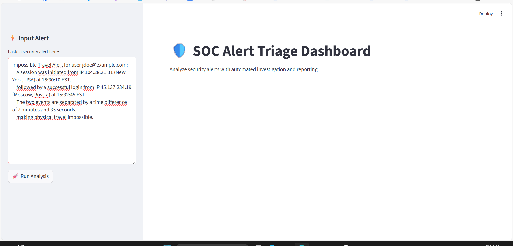
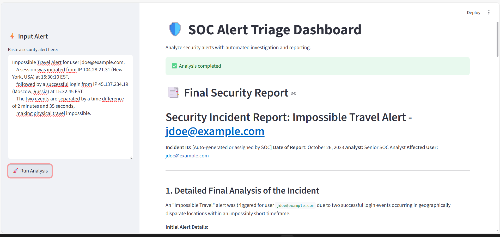
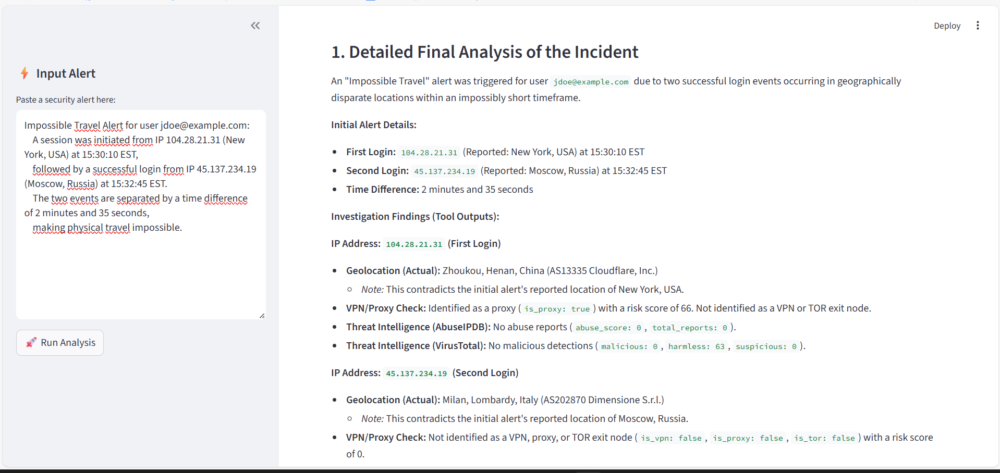

# 🛡️ SOC Alert Triage Dashboard  

This project is a **Security Operations Center (SOC) alert triage assistant** powered by **LangGraph**, **LangChain**, and **Google Gemini**.  

It takes raw security alerts (like Impossible Travel, Suspicious Login, etc.), enriches them using threat intelligence tools (VirusTotal, AbuseIPDB, GeoIP, VPN/Proxy check), and generates a **professional SOC analyst report**.  

The app provides a **Streamlit web dashboard** where you can paste alerts and instantly generate a structured incident report.  

---

## 🚀 Features
- 🧠 Automated triage with **Gemini 2.5 Flash**
- 🔧 Tool integrations:
  - VirusTotal report lookup  
  - AbuseIPDB reputation check  
  - GeoIP location lookup  
  - VPN/Proxy/TOR detection (ProxyCheck.io)  
- 📑 Generates **final SOC reports** with:
  - Incident summary  
  - Threat classification  
  - Recommended actions  
- 🌐 Beautiful **web dashboard** (Streamlit)  

---

## ⚙️ Installation  

1. **Clone this repository**  
   ```bash
   git clone https://github.com/<your-username>/<your-repo>.git
   cd <your-repo>
   ```

2. **Create and activate a virtual environment**  
   ```bash
   python -m venv venv
   source venv/bin/activate   # On Linux/Mac
   venv\Scripts\activate      # On Windows
   ```

3. **Install dependencies**  
   ```bash
   pip install -r requirements.txt
   ```

---

## 🔑 API Keys  

This project requires API keys for external services. Create a `.env` file in the project root with:  

```
GOOGLE_API_KEY=your_google_gemini_api_key
VT_API_KEY=your_virustotal_api_key
ABUSEIPDB_API_KEY=your_abuseipdb_api_key
PROXYCHECK_API_KEY=your_proxycheck_api_key
```

- Get Gemini API key → [Google AI Studio](https://aistudio.google.com/)  
- Get VirusTotal API key → [VirusTotal](https://www.virustotal.com/gui/my-apikey)  
- Get AbuseIPDB API key → [AbuseIPDB](https://www.abuseipdb.com/account/api)  
- Get ProxyCheck.io API key → [ProxyCheck.io](https://proxycheck.io/)  

---

## ▶️ Running the App  

### 1. Run in CLI (debug mode)
```bash
python main.py
```
This will execute the pipeline and print outputs step by step in the terminal.  

### 2. Run the Web Dashboard (recommended)
```bash
streamlit run web_app.py
```

Open your browser at [http://localhost:8501](http://localhost:8501).  

### Alert Input  
  

### Report Output  
  

### Report Output  
  

## 🎥 Demo  

https://github.com/Ziedao/SOC-alert-triage-X-langgraph/blob/master/screen-shots/demo.mp4?raw=true


---

## 📂 Project Structure  

```
.
├── main.py              # LangGraph pipeline (triage, tools, analysis)
├── tools.py             # Tool integrations (VirusTotal, AbuseIPDB, etc.)
├── web_app.py           # Streamlit web dashboard
├── requirements.txt     # Python dependencies
└── README.md            # Documentation
```

---

## 📊 Example Alert  

Paste something like this in the dashboard:  

```
Impossible Travel Alert for user jdoe@example.com:
A session was initiated from IP 104.28.21.31 (New York, USA) at 15:30:10 EST,
followed by a successful login from IP 45.137.234.19 (Moscow, Russia) at 15:32:45 EST.
The two events are separated by a time difference of 2 minutes and 35 seconds,
making physical travel impossible.
```

And you’ll get a **full SOC incident report** with enrichment and recommendations.  

---

## 📌 Requirements  

- Python 3.9+  
- Virtual environment recommended  
- Internet connection (for API calls)  

---

## 🛠️ Future Enhancements  

- Support for Splunk/ELK live alert ingestion  
- PDF export of reports  
- More enrichment tools (Shodan, GreyNoise, etc.)  

---

## 👨‍💻 Author  

Developed by **me** as part of a cybersecurity engineering project.  
